# The Tiki Craft

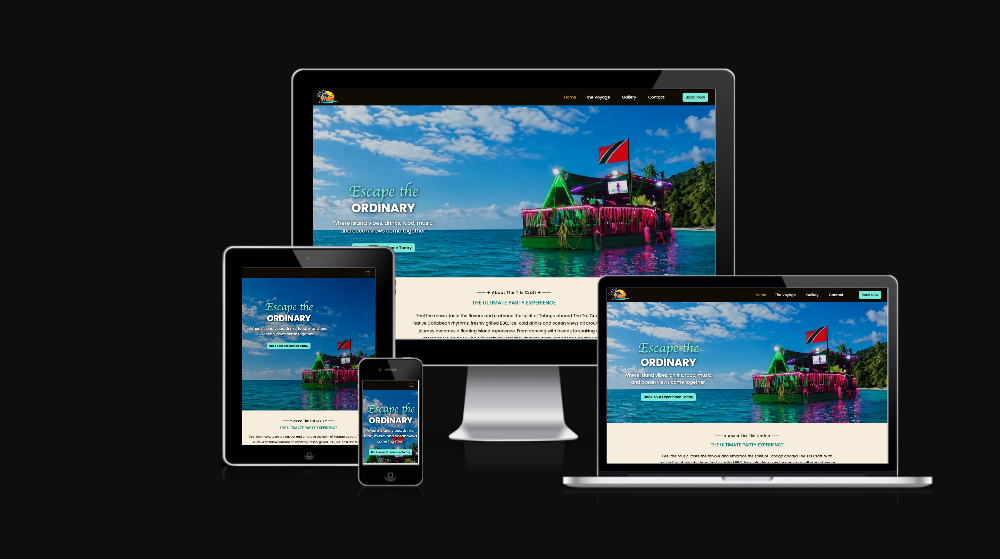

## Table of Contents

- [Project Overview](#project-overview)
- [Project Aims](#project-aims)
- [User Experience (UX)](#user-experience-ux)
- [Design](#design)
- [Features](#features)
- [Technologies Used](#technologies-used)
- [Testing](#testing)
- [Deployment](#deployment)
- [Credits](#credits)
- [Acknowledgements](#acknowledgements)

## Project Overview

The Tiki Craft is a fully responsive promotional website developed for **The Tiki Craft**, a floating beach bar and entertainment venue located in Tobago, Trinidad and Tobago.

The project was independently designed and developed as part of the Code Institute Level 5 Diploma in Web Application Development. Its purpose is to provide a modern and engaging online presence that showcases the experiences offered aboard The Tiki Craft while encouraging potential customers to submit a booking enquiry.

Visitors can explore available cruises, discover destinations around Tobago, browse an image gallery, view booking packages and pricing, and enquire about availability through a responsive booking form. Although this website was created for educational purposes, it was designed with a real business in mind and could potentially form part of The Tiki Craft's online presence in the future.

## Project Aims

The primary goal of this project was to create a modern, responsive promotional website that effectively promotes **The Tiki Craft** while demonstrating front-end web development skills.

The website was designed with the following objectives:

* Promote The Tiki Craft as a unique floating beach bar and entertainment venue in Tobago.
* Showcase the range of cruises, private charters and special experiences available.
* Encourage potential customers to make a booking enquiry through clear calls-to-action.
* Provide an intuitive and enjoyable user experience across mobile, tablet and desktop devices.
* Create a visually appealing design inspired by the colours, atmosphere and scenery of Tobago.
* Demonstrate the use of HTML5, CSS3 and Bootstrap 5 to build a fully responsive website following modern web development practices.

## User Experience (UX)

### Project Planning

The project was planned using GitHub Projects and managed using an Agile workflow. User stories were prioritised using the **MoSCoW** method to ensure that the core functionality was completed before optional enhancements.

The project board was divided into the following stages:

- **To Do** – Planned features not yet started.
- **In Progress** – Features currently under development.
- **Done** – Completed and tested features.

Throughout development, user stories were moved between columns as features progressed through development, providing a clear overview of project progress and priorities.

> **Note:** One *Could Have* feature (Customer Reviews Section) remains in the backlog as a future enhancement and was intentionally left out of the final release due to time constraints.

### User Stories

* **To Do** – Planned features awaiting development.
* **In Progress** – Features currently being implemented.
* **Completed** – Features successfully implemented and tested.

The majority of the planned user stories were completed during the development of this project. One user story remains in the **To Do** column as a potential enhancement for future development.

The full project board can be viewed here:
[The Tiki Craft GitHub Project Board](https://github.com/users/HollyBlue87/projects/4/views/1)

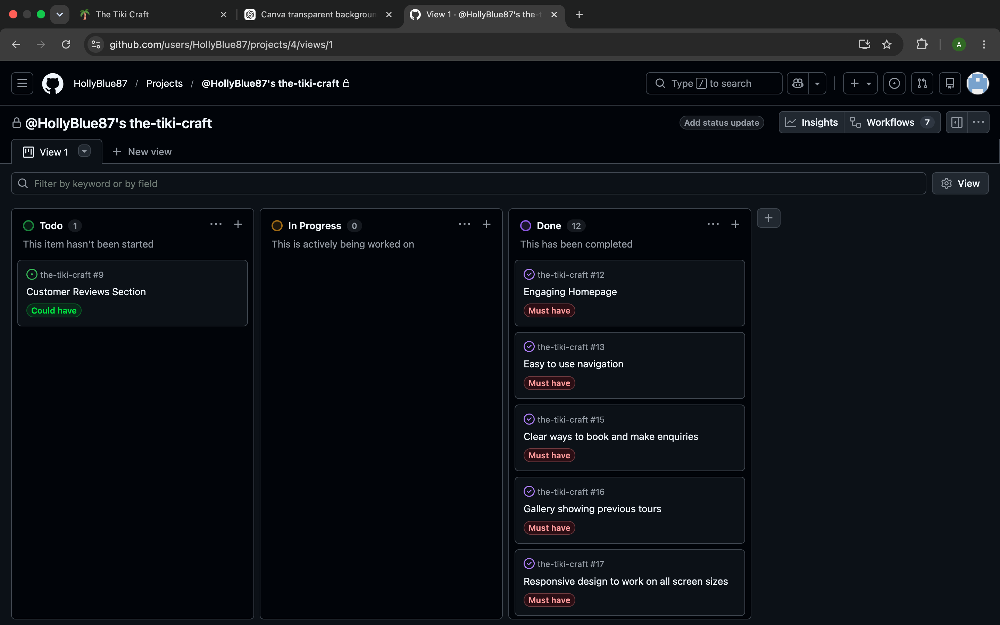

### Example User Story

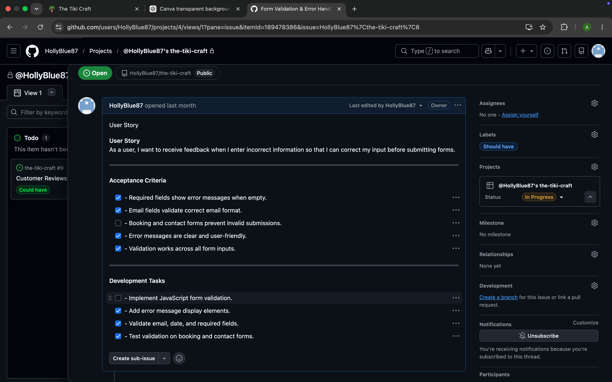

A summary of the primary user stories is provided below.

### Completed User Stories

The following user stories were successfully implemented during development

| Priority | User Story | Status |
|----------|------------|--------|
| Must Have | Engaging homepage | ✅ Complete |
| Must Have | Easy-to-use navigation | ✅ Complete |
| Must Have | Clear booking and enquiry process | ✅ Complete |
| Must Have | Gallery showcasing previous tours | ✅ Complete |
| Must Have | Responsive design | ✅ Complete |
| Must Have | Promote The Tiki Craft brand | ✅ Complete |
| Must Have | Showcase destinations | ✅ Complete |
| Must Have | Encourage new bookings | ✅ Complete |
| Must Have | Information about the Tiki Craft experience | ✅ Complete |
| Should Have | Form validation and error handling | ✅ Complete |
| Should Have | Social media integration | ✅ Complete |
| Could Have | Contact section | ✅ Complete |
| Could Have | Customer reviews | ❌ Future Enhancement |

### Target Audience

The website was designed with a broad audience in mind, focusing on both tourists and local residents looking for memorable experiences in Tobago.

The primary target audiences are:

* Tourists visiting Tobago looking for unique excursions and island experiences.
* Couples seeking romantic cruises and sunset experiences.
* Families looking for enjoyable group activities.
* Friends celebrating birthdays, reunions and special occasions.
* Local residents interested in private venue hire and themed events.

### User Goals

The website was designed to enable users to:

* Learn about The Tiki Craft and the experiences available.
* Explore destinations visited during cruises.
* Browse photographs of previous events and experiences.
* View available packages and pricing information.
* Submit a booking enquiry quickly and easily.
* Navigate the website intuitively on any device.

### Site Owner Goals

The primary goals of the business owner are to:

* Promote The Tiki Craft through a professional online presence.
* Showcase the range of cruises, private charters and special events available.
* Encourage potential customers to submit booking enquiries.
* Highlight Tobago's natural beauty and unique experiences.
* Increase brand awareness through a visually engaging website.

## Design

The design of **The Tiki Craft** was inspired by the vibrant atmosphere, tropical scenery and relaxed island lifestyle of Tobago. The aim was to create a visually engaging website that immediately communicates the experience offered aboard The Tiki Craft while maintaining excellent usability across all devices.

Throughout the design process, emphasis was placed on creating a clean, modern interface that reflects the personality of the business while making it easy for users to navigate, explore the available cruises and submit a booking enquiry.

### Colour Scheme

The colour palette was carefully selected to reflect the tropical environment surrounding The Tiki Craft. Colours were chosen to evoke the sea, beaches, sunshine and vibrant island atmosphere while maintaining sufficient contrast throughout most of the website.

The primary colours include:

* **Caribbean Teal** – Primary backgrounds and branding colour.
* **Sandy Beige** – Secondary backgrounds and content sections.
* **Ocean Mist Blue** – Primary call-to-action buttons.
* **Golden Sand** and **Sunset Gold** – Highlights and feature text.
* **Tropical Orange** – Pricing and important information.
* **Dark Brown/Black** – Navigation bar and footer to provide visual contrast.

The colour palette creates a consistent visual identity across the website while reinforcing the tropical branding of The Tiki Craft.

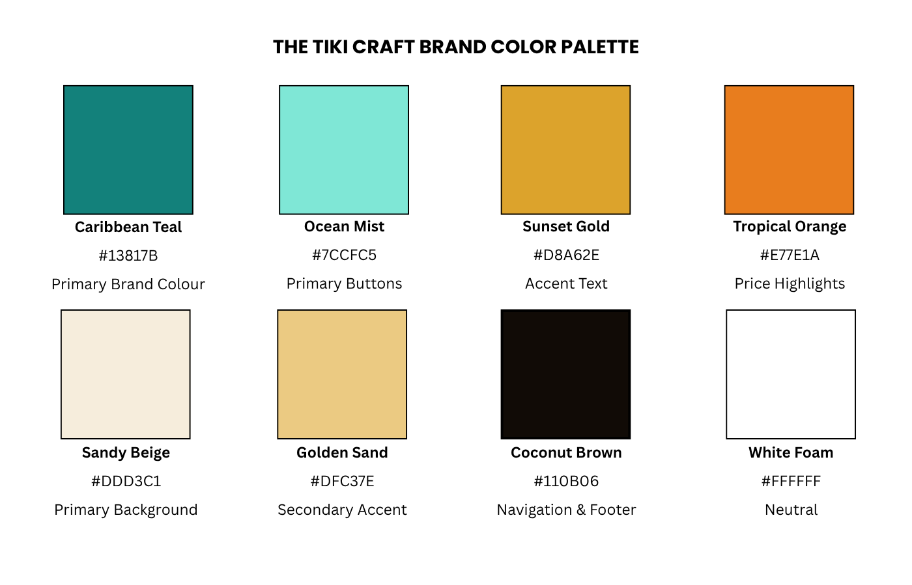

### Typography

Two Google Fonts were selected to balance readability with the relaxed tropical theme of the website.

* **Poppins** was used as the primary font throughout the website due to its clean, modern appearance and excellent readability across desktop and mobile devices.
* **Allura** was used selectively for decorative headings to introduce a more relaxed, handwritten style that complements the Caribbean aesthetic without affecting usability.

### Imagery

Authentic photography plays a major role throughout the website. Rather than relying on generic stock photography, images of the actual Tiki Craft experience were used wherever possible to give visitors an accurate representation of the cruises.

Large hero images were selected for each page to immediately immerse users in the tropical atmosphere, while additional photographs throughout the site showcase destinations, onboard experiences and previous guests.

The gallery page provides users with a larger collection of images, encouraging them to explore the experience in greater detail before making a booking enquiry.

### Wireframes

Wireframes were produced to communicate the responsive layout and structure of each page across mobile, tablet and desktop devices. As development progressed, several design decisions were refined, including the implementation of Bootstrap accordions and a modal booking form to improve usability. The wireframes below reflect the final design that was implemented.

Separate wireframes were produced for mobile, tablet and desktop layouts to ensure the design remained responsive across different screen sizes.

The layouts evolved throughout development as usability improvements were identified. For example, the booking information was ultimately presented using Bootstrap accordions to reduce scrolling and improve organisation, particularly on smaller devices.

#### Homepage

| Mobile                                                           | Tablet                                                           | Desktop                                                            |
| ---------------------------------------------------------------- | ---------------------------------------------------------------- | ------------------------------------------------------------------ |
| 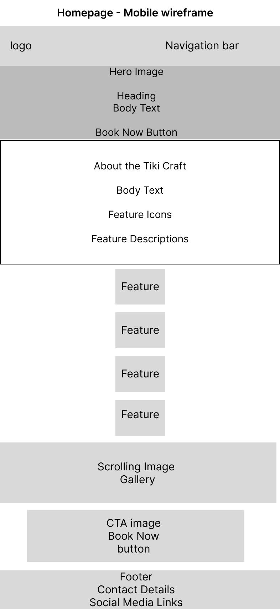 | 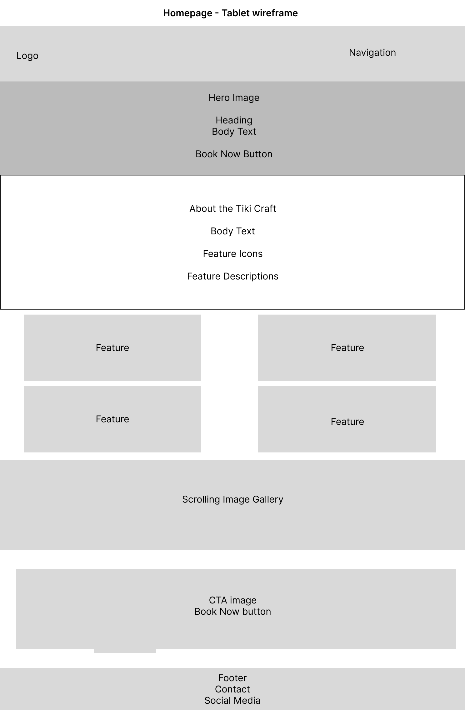 | 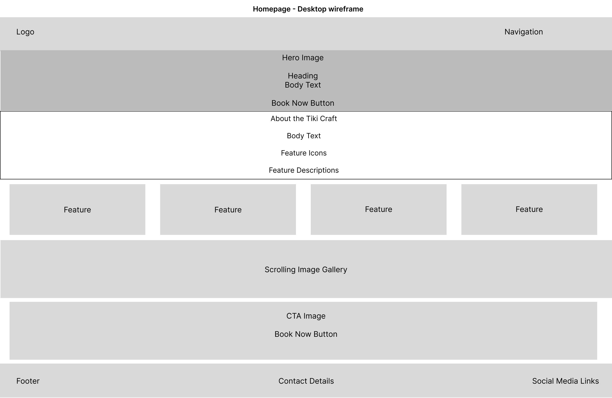 |

#### Voyage

| Mobile                                                       | Tablet                                                       | Desktop                                                        |
| ------------------------------------------------------------ | ------------------------------------------------------------ | -------------------------------------------------------------- |
| 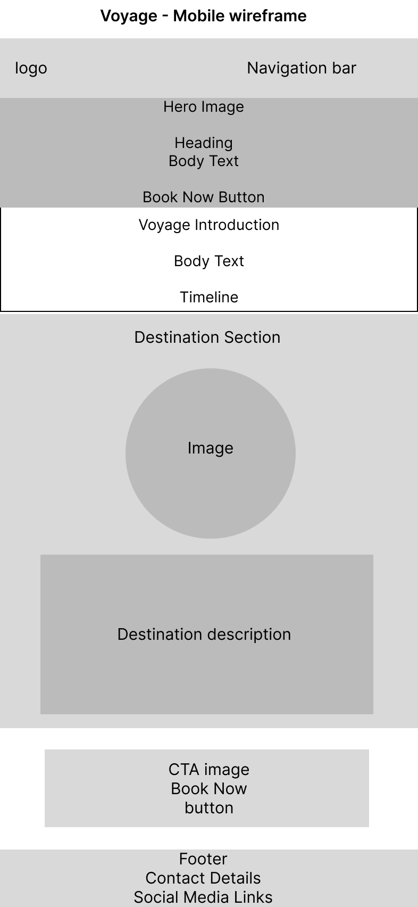 | 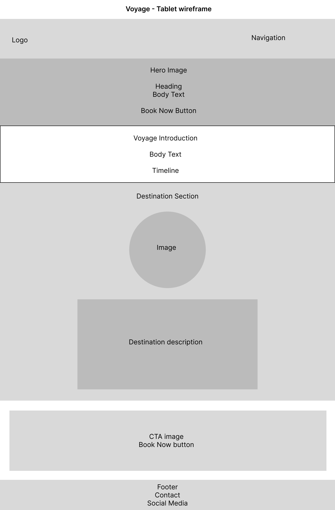 | 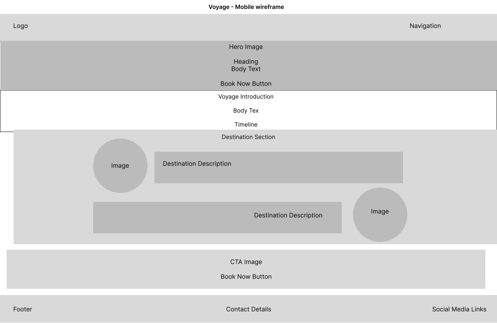 |

#### Gallery

| Mobile                                                         | Tablet                                                         | Desktop                                                          |
| -------------------------------------------------------------- | -------------------------------------------------------------- | ---------------------------------------------------------------- |
| 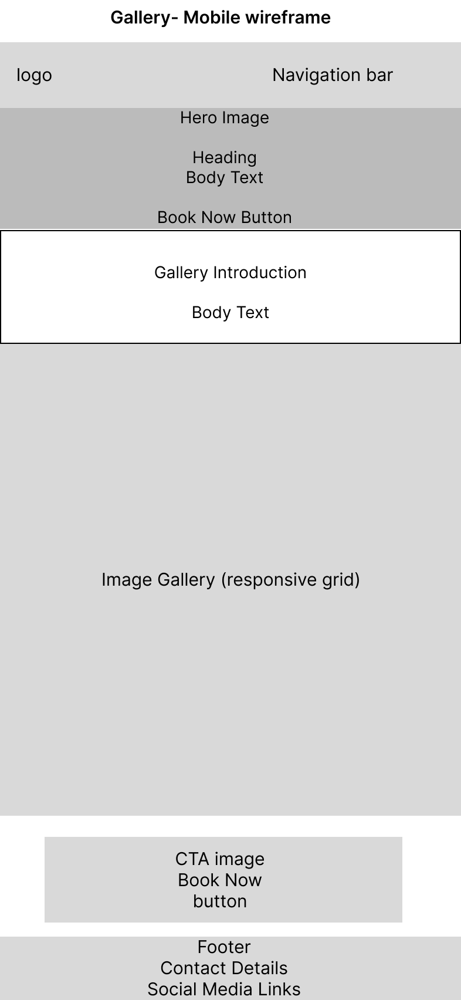 | 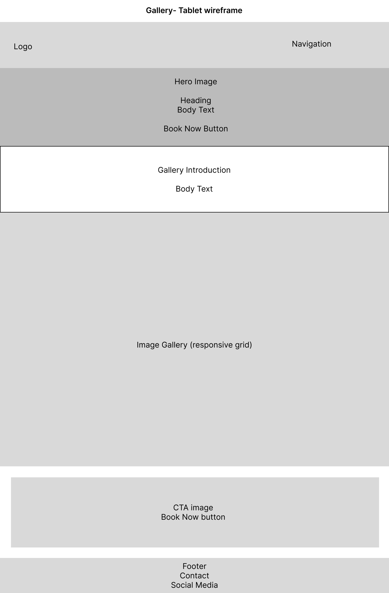 | 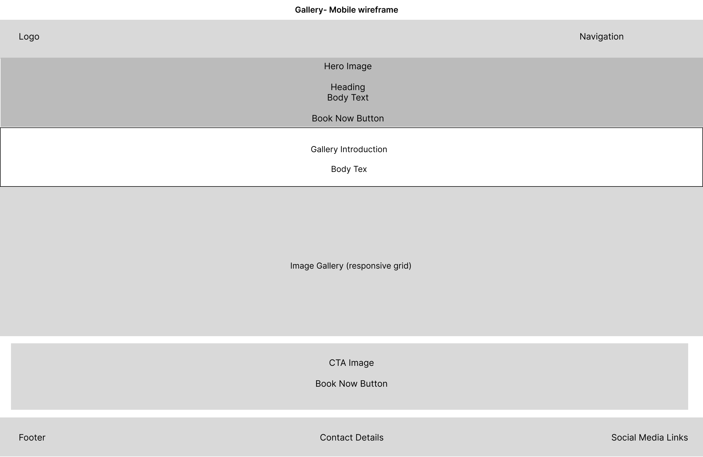 |

#### Booking

| Mobile                                                         | Tablet                                                         | Desktop                                                          |
| -------------------------------------------------------------- | -------------------------------------------------------------- | ---------------------------------------------------------------- |
| 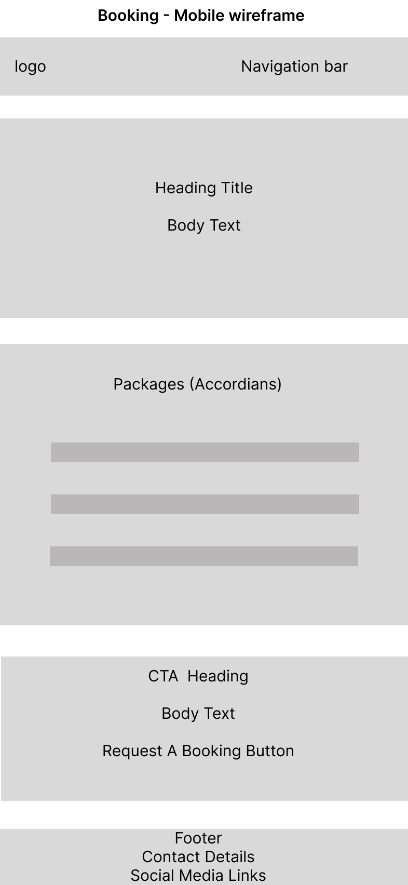 | 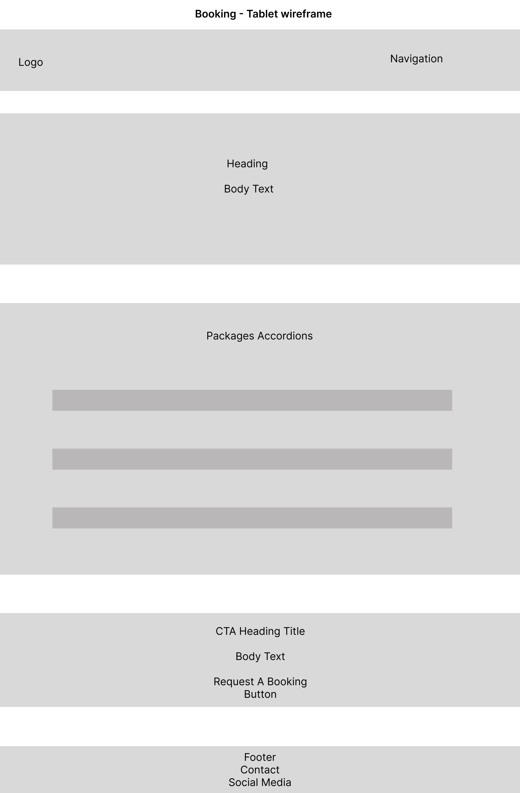 | 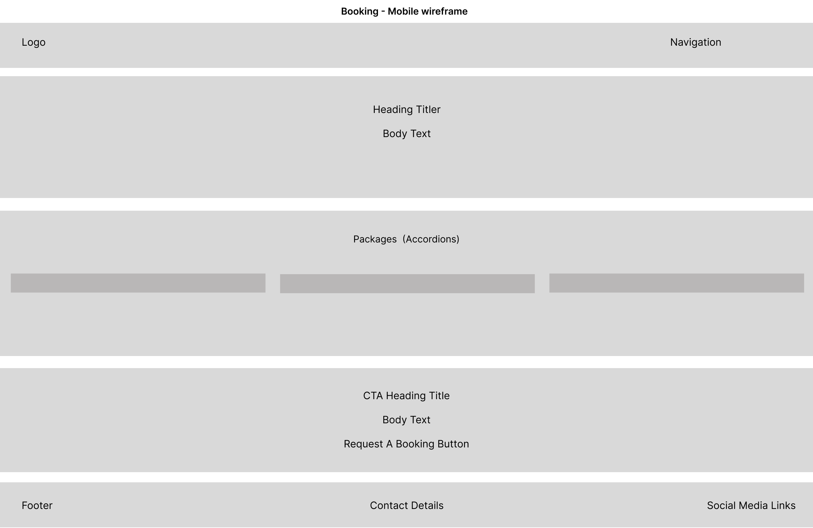 |

#### Booking Modal

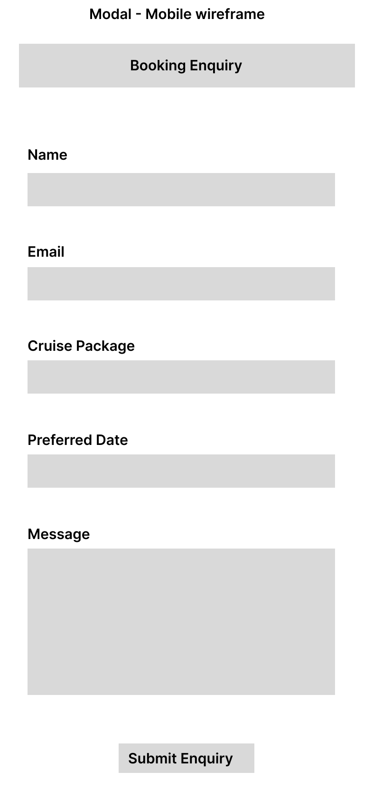

*The booking enquiry form was implemented using a Bootstrap modal to keep the booking page clean and uncluttered. This allows users to review pricing information before opening the enquiry form, creating a smoother user experience without navigating away from the page.*

### Design Decisions

A number of design decisions were made throughout the development process to improve both the user experience and the overall presentation of the website.

#### Mobile-First Development

The website was developed using a mobile-first approach, taking advantage of Bootstrap's responsive grid system. This ensured that the site functioned effectively on smaller devices before progressively adapting to tablet and desktop layouts.

#### Bootstrap Framework

Bootstrap 5 was selected as the primary front-end framework because it formed part of the project requirements and provided a responsive grid system along with reusable components that accelerated development while maintaining consistency across the website.

#### Fixed Navigation Bar

A fixed navigation bar was implemented to allow users to navigate between pages at any point without needing to scroll back to the top. This improves usability, particularly on longer pages.

#### Hero Sections

Each page features a large hero image showcasing the natural beauty and atmosphere of The Tiki Craft. These images immediately communicate the tropical experience and establish a consistent visual identity across the website.

#### Bootstrap Cards

Bootstrap cards were used throughout the website to present destinations and key information in a clean, structured format. Their flexibility allowed consistent styling while maintaining responsiveness across all screen sizes.

#### Bootstrap Accordions

The booking packages were presented using Bootstrap accordions to reduce excessive scrolling and keep the page organised. Users can quickly expand only the information they are interested in, creating a cleaner and more intuitive experience.

#### Booking Modal

Rather than embedding a large booking form directly onto the page, a Bootstrap modal was used to display the enquiry form. This allows users to review package information before opening the form, resulting in a less cluttered layout and a more premium user experience.

#### Icons

Icons were used to quickly communicate key features of The Tiki Craft experience. This allows visitors to scan important information without reading large blocks of text, improving usability while reinforcing the tropical theme.

#### Calls-to-Action

Consistent call-to-action buttons are positioned throughout the website to encourage users to make a booking enquiry after viewing information about the cruises. Placing these strategically throughout the site reduces the number of steps required for users to begin the booking process.

#### Imagery

Authentic photographs of The Tiki Craft were used throughout the website instead of generic stock photography. This provides visitors with an accurate representation of the experience and helps establish trust with potential customers.

## Features

### Homepage

The homepage introduces visitors to The Tiki Craft through a full-width hero image showcasing the experience, accompanied by a welcoming introduction and a prominent call-to-action button encouraging users to make a booking enquiry.

Key features include:

- Fixed navigation bar for easy access to all pages.
- Large hero image with introductory text and booking call-to-action.
- About section introducing The Tiki Craft experience.
- Feature icons highlighting the main attractions of the voyage.
- Feature cards presenting key selling points.
- Scrolling image gallery preview.
- Final call-to-action section encouraging bookings.
- Footer containing contact information and social media links.

---

### Voyage Page

The Voyage page provides visitors with detailed information about the available cruises, helping them choose the experience that best suits their needs before making a booking enquiry.

Key features include:

- Hero image with page introduction.
- Cruise information displayed using Bootstrap accordions.
- Clearly displayed pricing.
- Frequently asked questions section.
- Booking call-to-action button.
- Fixed navigation and footer.

---

### Gallery Page

The Gallery page allows visitors to preview photographs from previous voyages, giving them a realistic expectation of the experience.

Key features include:

- Hero image.
- Responsive image gallery.
- Optimised images for improved loading performance.
- Booking call-to-action section.
- Fixed navigation and footer.

---

### Booking Page

The Booking page enables visitors to submit an enquiry for their preferred voyage using a clean and user-friendly booking form displayed within a Bootstrap modal.

Key features include:

- Hero image.
- Booking information section.
- Bootstrap modal booking form.
- Client-side form validation.
- Submit button directing users to the booking confirmation page.
- Fixed navigation and footer.

---

### Booking Confirmation Page

The booking confirmation page reassures visitors that their enquiry has been successfully submitted.

Key features include:

- Confirmation message.
- Confirmation icon.
- Return to homepage button.
- Consistent branding and navigation.

---

### Custom 404 Page

A custom 404 page ensures users remain within the site's branding if they attempt to access a page that does not exist.

Key features include:

- Friendly error message.
- Branded design matching the rest of the website.
- Button returning users to the homepage.

## Future Enhancements

If this project were to be developed further for use by The Tiki Craft business, the following features would be considered:

- Implement a complete online booking system allowing customers to select an available date and make secure payments directly through the website.
- Generate automatic booking confirmation emails containing voyage details and customer information.
- Issue digital e-tickets with QR codes that can be scanned when customers arrive for their cruise.
- Develop an administrative dashboard enabling staff to manage bookings, customer details, and voyage availability.
- Introduce a customer account system where users can view, amend, or cancel their bookings.
- Display live availability for each cruise to prevent overbooking.
- Add customer reviews and testimonials to build trust with future visitors.
- Integrate Google Maps to provide directions to the departure location.
- Include weather forecasts and sea conditions to help visitors plan their trip.
- Expand the gallery with videos submitted by customers alongside professional photography.
- Add an image lightbox or modal gallery so visitors can view photographs at a larger size without leaving the gallery page.
- Replace the enquiry form with a fully integrated booking management system that allows customers to check availability, reserve cruises and receive instant confirmation.

## Technologies Used

### Languages

The following languages were used throughout the development of this project:

* **HTML5** – Used to structure the content and layout of the website.
* **CSS3** – Used to create the custom styling, responsive layouts and overall visual design.

### Frameworks, Libraries and Programs

The following frameworks, libraries and software were used during the design and development of this project:

* **Bootstrap 5.3** – Used to create the responsive layout and implement components including the navigation bar, cards, accordion, modal, buttons and grid system.
* **Google Fonts** – Used to import the Poppins and Allura fonts.
* **Font Awesome** – Used to provide icons throughout the website.
* **Git** – Used for version control during development.
* **GitHub** – Used to host the project repository and manage project planning through GitHub Projects.
* **GitHub Pages** – Used to deploy the live website.
* **Visual Studio Code** – Used as the primary code editor.
* **Figma** – Used to create the responsive wireframes.
* **Canva** – Used to create the colour palette and supporting README graphics.
* **TinyPNG / TinyJPG** – Used to compress images before deployment.
* **Squoosh** – Used to convert and optimise images into WebP format to improve website performance.
* **W3C HTML Validator** – Used to validate all HTML pages.
* **W3C CSS Validator** – Used to validate the CSS stylesheet.
* **Google Lighthouse** – Used to test performance, accessibility, best practices and SEO.
* **Chrome DevTools** – Used throughout development for debugging, responsive testing and performance analysis.

## Testing

### HTML Validation

All HTML pages were validated using the **W3C Markup Validation Service**.

During development, several validation errors were identified and corrected. As the project was built using a common page template, many of these errors appeared across multiple pages before being resolved.

The issues identified included:

* Duplicate `<meta charset>` declarations.
* `<title>` element positioned outside the `<head>` section.
* Favicon `<link>` elements placed inside the `<body>`.
* An additional closing `</head>` tag.
* Duplicate `<body>` tag.
* A stray closing `</a>` tag.
* A duplicated attribute within the navigation bar.

After correcting these issues, every HTML page successfully passed validation with no errors.

| Page         | Result   |
| ------------ | -------- |
| index.html   | ✅ Passed |
| voyage.html  | ✅ Passed |
| gallery.html | ✅ Passed |
| booking.html | ✅ Passed |
| success.html | ✅ Passed |
| 404.html     | ✅ Passed |

#### Example Validation

**Before**

*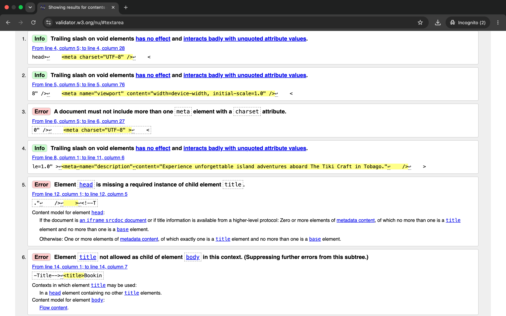*

**After**

*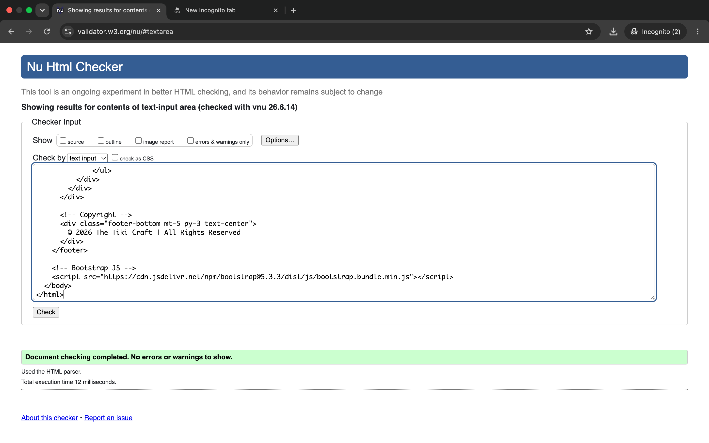*

### CSS Validation

During development, the validator reported several parsing and lexical errors. These were traced to a small number of syntax issues within the stylesheet rather than multiple independent CSS problems.

The issues identified included:

* CSS parse errors caused by incorrect syntax.
* Lexical errors resulting from accidental Git merge markers (@@) being left in the stylesheet.
* Invalid CSS caused by the parser being interrupted after the merge markers.
* A small number of warnings were reviewed and confirmed not to affect the functionality of the * website.

After removing the merge markers and correcting the CSS syntax, the stylesheet successfully passed validation with no errors.

#### Before Fixes

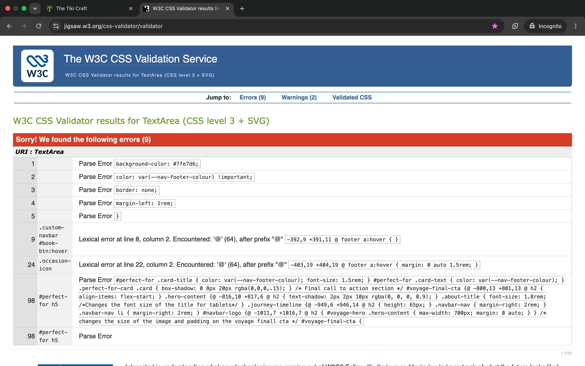

#### After Fixes

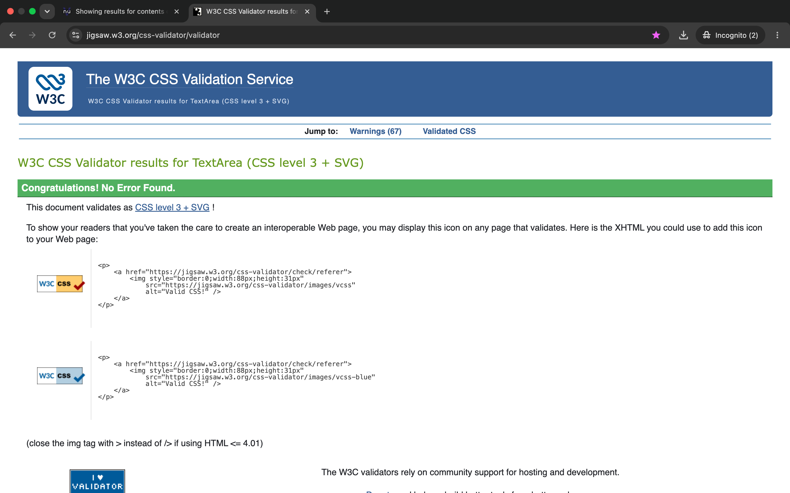

### Lighthouse Testing

Google Lighthouse was used throughout development to assess the website's performance, accessibility, best practices and search engine optimisation (SEO). Testing was carried out on each page following deployment to GitHub Pages.

Performance was improved during development by:

* Converting images to the WebP format where appropriate.
* Resizing and compressing images to reduce file sizes.
* Adding width and height attributes to images to reduce layout shifts.
* Removing unused CSS where possible.
* Using semantic HTML to improve accessibility and SEO.

Despite further optimisation, the Performance score remains influenced by external CDN resources (Bootstrap, Google Fonts and Font Awesome) and GitHub Pages caching, both of which are outside the scope of this project.

| Page    |   Performance | Accessibility | Best Practices |                    SEO |
| ------- | ------------: | ------------: | -------------: | ---------------------: |
| Home    |            75 |            95 |            100 |                     91 |
| Voyage  |            73 |            95 |             96 |                    100 |
| Gallery |            74 |            95 |             96 |                    100 |
| Booking |            80 |            95 |             96 |                    100 |
| Success |            94 |           100 |             96 |                    100 |
| 404     |            74 |           100 |             96 |                    100 |


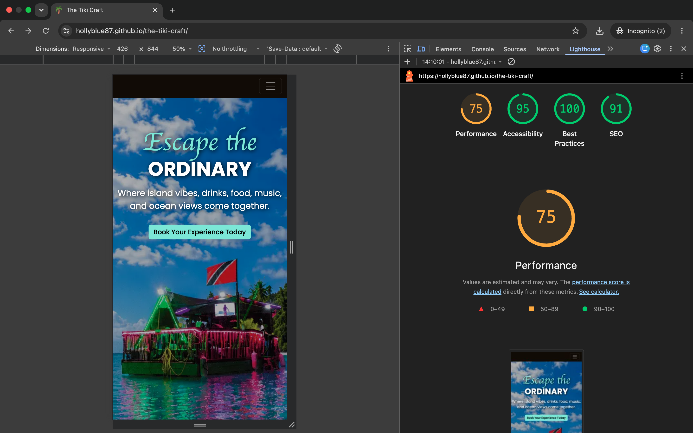

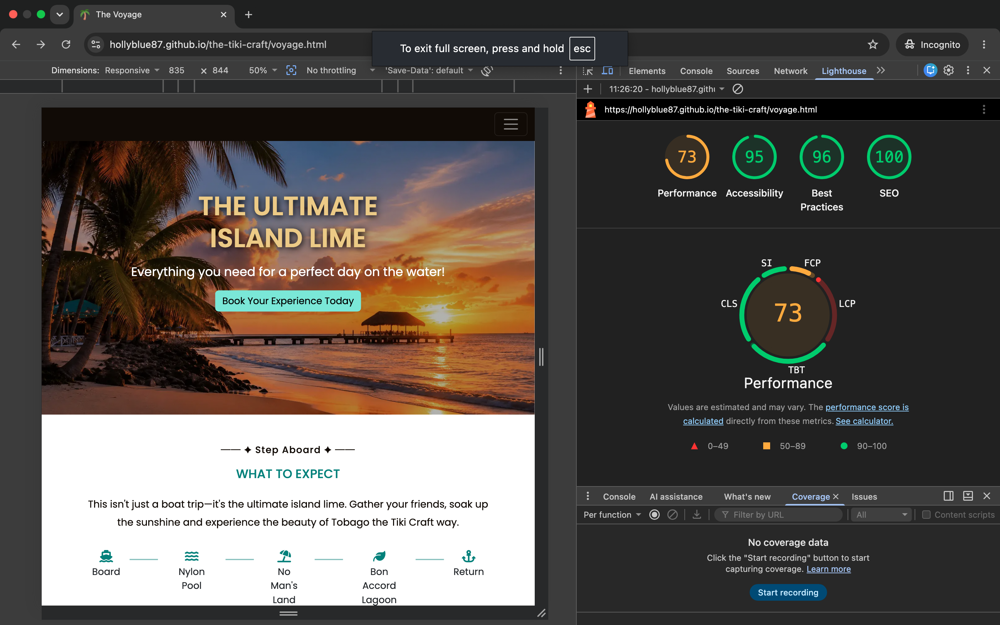

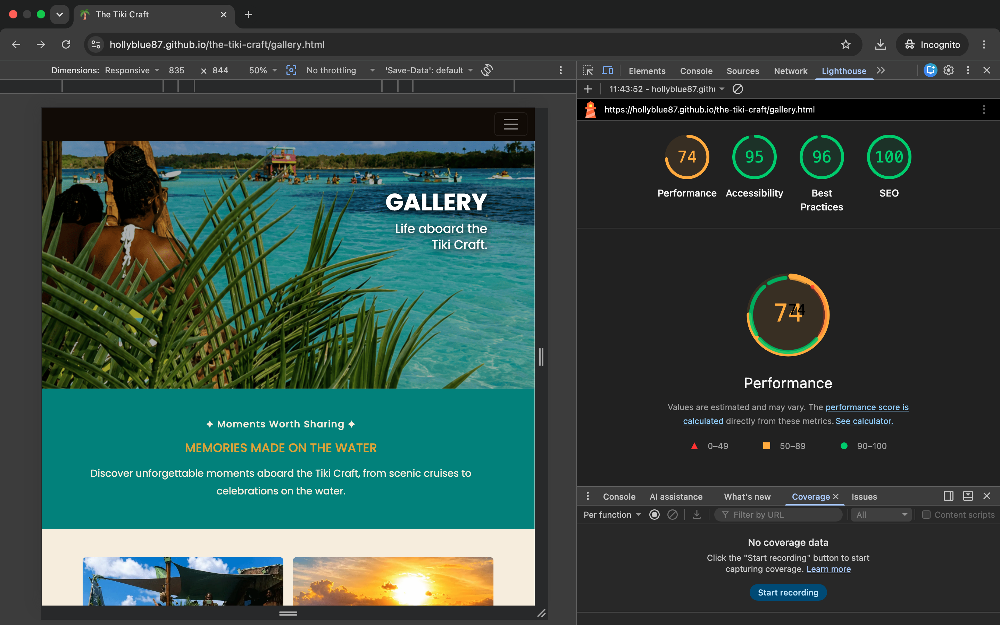

### Browser Compatibility Testing

The website was tested across multiple modern web browsers to ensure consistent functionality, responsiveness and appearance.

| Browser         | Result             |
| --------------- | ------------------ |
| Google Chrome   | ✅ Fully functional |
| Microsoft Edge  | ✅ Fully functional |
| Mozilla Firefox | ✅ Fully functional |
| Safari          | ✅ Fully functional |

No significant cross-browser compatibility issues were identified during testing.

### Device Testing

The website was tested throughout development on a range of physical devices to ensure responsive layouts, consistent styling and full functionality across different screen sizes.

| Device      | Browser       | Result             |
| ----------- | ------------- | ------------------ |
| MacBook     | Google Chrome | ✅ Fully functional |
| MacBook     | Safari        | ✅ Fully functional |
| iPhone 16   | Safari        | ✅ Fully functional |
| iPhone 14   | Safari        | ✅ Fully functional |
| Samsung A16 | Google Chrome | ✅ Fully functional |
| Samsung A12 | Google Chrome | ✅ Fully functional |
| iPad        | Safari        | ✅ Fully functional |

Testing confirmed that the website was fully responsive across mobile, tablet and desktop devices. Navigation, forms, images, buttons, modals and responsive layouts functioned as expected with no significant issues identified.

## User Story Testing

The completed user stories were manually tested throughout development to ensure that each requirement was successfully implemented and functioned as expected. The table below demonstrates how each user story was validated.

| User Story | How it was Tested | Result |
|------------|-------------------|--------|
| As a visitor, I want an engaging homepage so I immediately understand what The Tiki Craft offers. | Tested the homepage hero section, calls-to-action, promotional content and responsive layout across multiple devices. | ✅ Pass |
| As a visitor, I want easy-to-use navigation so I can quickly find information. | Tested every navigation link on desktop, tablet and mobile devices. Confirmed the fixed navigation bar remained accessible while scrolling. | ✅ Pass |
| As a visitor, I want to learn about available voyages and packages before booking. | Tested the Voyage page, ensuring all package information, pricing, accordions and destination content displayed correctly. | ✅ Pass |
| As a visitor, I want to browse photos from previous cruises before making a decision. | Tested the Gallery page to ensure all images loaded correctly, the horizontal scrolling gallery functioned, image hover effects displayed correctly and navigation arrows scrolled the gallery as expected. | ✅ Pass |
| As a visitor, I want to submit a booking enquiry quickly and easily. | Tested the booking modal using both valid and invalid inputs, confirming required field validation, email validation and minimum date restrictions before successful submission. | ✅ Pass |
| As a visitor, I want confirmation that my enquiry has been submitted. | Submitted a valid booking enquiry and confirmed the success page displayed correctly with navigation options back into the website. | ✅ Pass |
| As a visitor, I want the website to work across different devices and browsers. | Tested the website on multiple physical devices and browsers to verify responsive layouts, navigation and functionality. | ✅ Pass |
| As the business owner, I want to promote The Tiki Craft brand professionally. | Verified consistent branding, typography, imagery, colour palette and calls-to-action across every page. | ✅ Pass |
| As the business owner, I want to encourage users to enquire about bookings. | Tested every booking button and call-to-action throughout the website to ensure they opened the booking modal or directed users to the booking process. | ✅ Pass |

Detailed manual testing for each page, feature and device is provided in the following section.

## Manual Testing

### Homepage

| Feature | Test Performed | Expected Result | Status |
|---------|----------------|-----------------|--------|
| Navigation bar | Clicked each navigation link | User is taken to the correct page or section | ✅ Pass |
| Book Now button | Clicked hero CTA | Booking page opens | ✅ Pass |
| Fixed navigation | Scrolled the page | Navigation remains visible at the top | ✅ Pass |
| Hero section | Checked heading, text and CTA | All content displays correctly without overlap | ✅ Pass |
| About section | Checked responsive layout | Text and icons remain aligned on all screen sizes | ✅ Pass |
| Feature icons | Checked icon display | Icons load correctly with no missing images | ✅ Pass |
| Feature cards | Checked layout on different devices | Cards remain aligned and responsive | ✅ Pass |
| Gallery preview | Clicked View Gallery button | Gallery page opens | ✅ Pass |
| Final CTA | Clicked Book Now button | Booking page opens | ✅ Pass |
| Footer links | Tested social media icons | Each icon opens the correct external website | ✅ Pass |
| Contact information | Checked phone, email and address | Information displays correctly | ✅ Pass |

---

### Voyage Page

| Feature | Test Performed | Expected Result | Status |
|---------|----------------|-----------------|--------|
| Hero section | Checked image and heading | Hero displays correctly across devices | ✅ Pass |
| Destination overview | Checked text formatting | Content is readable with no layout issues | ✅ Pass |
| Timeline section | Checked timeline layout | Timeline remains correctly aligned on all devices | ✅ Pass |
| Perfect for Every Occasion cards | Checked responsive layout | Cards remain aligned and readable | ✅ Pass |
| Final CTA | Clicked Book Your Voyage button | Booking page opens | ✅ Pass |
| Footer | Checked links and contact details | All information displays correctly | ✅ Pass |

---

### Gallery Page

| Feature | Test Performed | Expected Result | Status |
|---------|----------------|-----------------|--------|
| Gallery grid | Checked responsive layout | Images remain aligned across screen sizes | ✅ Pass |
| Gallery images | Checked image quality | Images display clearly with no distortion | ✅ Pass |
| Gallery images | Checked all images load | No broken or missing images | ✅ Pass |
| Final CTA | Clicked booking button | Booking page opens | ✅ Pass |
| Footer | Checked links and contact details | All information displays correctly | ✅ Pass |

---

### Booking Page

| Feature | Test Performed | Expected Result | Status |
|---------|----------------|-----------------|--------|
| Package cards | Checked layout | Cards remain aligned across devices | ✅ Pass |
| Pricing accordions | Opened and closed each accordion | Correct pricing information expands and collapses | ✅ Pass |
| Booking button | Clicked Book Now | Booking modal opens | ✅ Pass |
| Booking modal | Checked modal opens | Modal displays correctly | ✅ Pass |
| Required fields | Submitted empty form | Validation messages appear | ✅ Pass |
| Name field | Entered valid name | Field accepts input | ✅ Pass |
| Email field | Entered invalid email | Browser validation prevents submission | ✅ Pass |
| Email field | Entered valid email | Field accepts valid email address | ✅ Pass |
| Date field | Selected booking date | Date is accepted | ✅ Pass |
| Number of guests | Selected guest number | Selection works correctly | ✅ Pass |
| Package selection | Selected package | Selected option is displayed | ✅ Pass |
| Additional information | Entered text | Text is accepted correctly | ✅ Pass |
| Submit booking | Submitted completed form | User is redirected to confirmation page | ✅ Pass |

---

### Confirmation Page

| Feature | Test Performed | Expected Result | Status |
|---------|----------------|-----------------|--------|
| Confirmation message | Submitted booking form | Confirmation page loads successfully | ✅ Pass |
| Return Home button | Clicked button | Homepage opens | ✅ Pass |

---

### 404 Page

| Feature | Test Performed | Expected Result | Status |
|---------|----------------|-----------------|--------|
| Invalid URL | Entered incorrect page address | Custom 404 page is displayed | ✅ Pass |
| Return Home button | Clicked button | Homepage opens successfully | ✅ Pass |

---

### Responsive Testing

| Device | Test Performed | Expected Result | Status |
|--------|----------------|-----------------|--------|
| iPhone 14 | Tested all pages | Layout remains responsive | ✅ Pass |
| iPhone 16 | Tested all pages | Layout remains responsive | ✅ Pass |
| Samsung A12 | Tested all pages | Layout remains responsive | ✅ Pass |
| Samsung A16 | Tested all pages | Layout remains responsive | ✅ Pass |
| iPad | Tested all pages | Layout adjusts correctly | ✅ Pass |
| MacBook | Tested all pages | Desktop layout displays correctly | ✅ Pass |

---

### Cross Browser Testing

| Browser | Test Performed | Expected Result | Status |
|---------|----------------|-----------------|--------|
| Google Chrome | Tested all pages | Website functions correctly | ✅ Pass |
| Microsoft Edge | Tested all pages | Website functions correctly | ✅ Pass |
| Mozilla Firefox | Tested all pages | Website functions correctly | ✅ Pass |
| Safari | Tested all pages | Website functions correctly | ✅ Pass |

---

## Bugs

### Resolved Bugs

During development, several bugs were identified through testing and were successfully resolved before the final deployment.

| Bug | Resolution |
|-----|------------|
| Hero text alignment was incorrect on tablet devices. | Updated the Bootstrap layout and custom CSS to correctly centre the hero content across all screen sizes. |
| Footer navigation linked to `voyages.html` instead of `voyage.html`. | Corrected the file path so the link directs users to the correct page. |
| Gallery images were renamed with a `.webp` extension but had not been converted to the WebP format. | Converted all applicable images to genuine WebP files and re-optimised them to improve performance. |
| Some images appeared outdated after deployment due to browser caching. | Cleared the browser cache and confirmed that the updated images were loading correctly. |
| The booking modal allowed users to select dates in the past. | Implemented JavaScript to set the minimum selectable date to the current day, preventing past dates from being selected. |
| The booking confirmation and custom 404 page buttons stretched across the full width of smaller screens. | Updated the Bootstrap button layout to maintain an appropriate button size on mobile devices. |
| The message textarea within the booking modal displayed the cursor part way across the field. | Removed the whitespace inside the `<textarea>` element so the cursor begins at the correct position. |
| Gallery hover effects were not initially applying correctly after CSS changes. | Updated the CSS selectors and image classes so the hover effect applied consistently across the gallery. |
| Horizontal gallery navigation was improved by adding left and right scroll controls. | Added JavaScript-controlled navigation buttons to improve usability on desktop devices. |

### Known Issues

At the time of submission, no known functional bugs remain.

Google Lighthouse continues to report opportunities to improve performance due to external CDN resources (Bootstrap, Google Fonts and Font Awesome) and GitHub Pages caching behaviour. These factors do not affect the functionality of the website.

## Deployment

### GitHub Pages Deployment

The website was deployed using **GitHub Pages**.

To deploy the project:

1. Log in to GitHub and open the project repository.
2. Select the **Settings** tab.
3. From the left-hand menu, choose **Pages**.
4. Under **Build and deployment**, select:
   - **Source:** Deploy from a branch
   - **Branch:** `main`
   - **Folder:** `/ (root)`
5. Click **Save**.
6. GitHub will automatically build and deploy the website.
7. Once deployment is complete, a live link to the website will appear at the top of the GitHub Pages settings.

### Live Website

The live website can be viewed here:

**https://hollyblue87.github.io/the-tiki-craft/**

### Repository

The GitHub repository for this project can be found here:

**https://github.com/HollyBlue87/the-tiki-craft**

---

### Forking the Repository

To create a copy of this repository:

1. Log in to GitHub.
2. Navigate to the repository.
3. Click the **Fork** button in the top-right corner.
4. GitHub will create a copy of the repository under your own account.

---

### Cloning the Repository

To clone the repository to your local machine:

1. Open the repository on GitHub.
2. Click the green **Code** button.
3. Copy the HTTPS URL.
4. Open a terminal or Git Bash.
5. Navigate to the directory where you want to store the project.
6. Run the following command:

```bash
git clone https://github.com/HollyBlue87/the-tiki-craft.git
```

7. Open the project in your preferred code editor.

---

### Running the Project Locally

After cloning the repository:

1. Open the project folder in Visual Studio Code (or another code editor).
2. Open the `index.html` file using a live development server such as the **Live Server** extension for Visual Studio Code.
3. The website will open in your default web browser and can be viewed locally.

## Credits

### Content

- Information about **The Tiki Craft**, its cruises, destinations and packages was gathered from the official Tiki Craft social media pages and adapted for this educational project.
- Website copy was written by the project author using information about the business and refined with AI assistance where appropriate.
- Frequently Asked Questions were written specifically for this project based on the services offered by The Tiki Craft.

### Media

- Photographs used throughout the website were provided by **The Tiki Craft** and used with permission for this educational project.
- The Tiki Craft logo and branding remain the property of **The Tiki Craft**.
- Favicon generated using **RealFaviconGenerator**.

### Code

The following resources were used throughout development:

- **Bootstrap 5.3** documentation for the responsive grid system, navbar, cards, buttons, accordion, modal and utility classes.
- **MDN Web Docs** for HTML and CSS reference.
- **W3C HTML Validator** for validating all HTML pages.
- **W3C CSS Validator** for validating the stylesheet.
- **Google Lighthouse** for performance, accessibility and SEO testing.
- **TinyPNG** and **Squoosh** for image compression and optimisation.
- **Figma** for producing responsive wireframes.
- **Canva** for creating the colour palette and README graphics.

The JavaScript used to prevent users from selecting past booking dates was implemented following guidance from a fellow developer and adapted to integrate with the booking modal used in this project.

### Acknowledgement of AI Assistance

ChatGPT was used throughout the planning and development of this project to: 
 
- Explain Bootstrap components. 
- Provide information on improving website performance.
- Assist in understanding errors found by HTML and CSS validators.

## Acknowledgements

I would like to thank the following people and organisations for their support throughout the development of this project:

- **Code Institute** for providing the course materials, project guidance and learning resources.
- **University Centre Peterborough** for delivering and supporting the programme.
- **Raghav Kovvuri** for providing valuable feedback and advice during the development process.
- **Zach Lagden** for discussing design decisions and providing guidance on implementing the JavaScript date validation.
- **The Tiki Craft** for allowing the use of their branding and photographs for this educational project.
- **Friends and family** who tested the website on different devices and provided valuable feedback throughout development.


